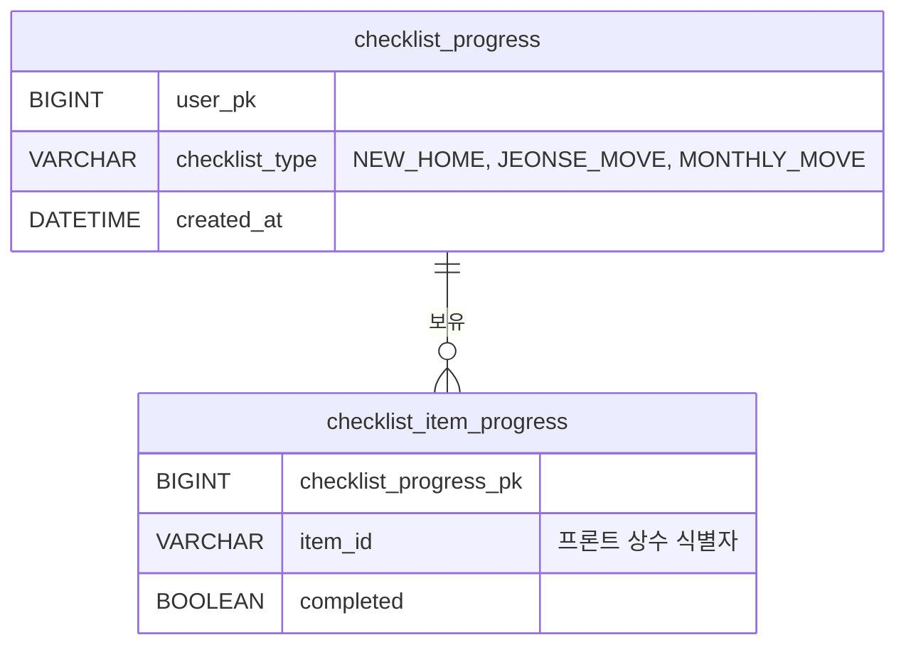

# 데이터베이스

## 설계 원칙
- 체크리스트 **항목 내용**은 코드(정적 상수)로 관리 → DB 저장 불필요
- DB에는 **"누가 어떤 항목을 완료했는가"** 만 저장
- 비로그인 User의 진행 상태는 localStorage로만 관리 → DB 불필요

---

## ERD

---

## 테이블 상세

### checklist_progress
User 1명 × 체크리스트 타입 1개 = 행 1개

| 컬럼 | 타입 | 제약 | 설명 |
|------|------|------|------|
| pk | BIGINT | PK, AUTO_INCREMENT | |
| user_pk | BIGINT | NOT NULL | 자리톡 User PK |
| checklist_type | VARCHAR(20) | NOT NULL | `NEW_HOME` / `JEONSE_MOVE` / `MONTHLY_MOVE` |
| created_at | DATETIME | NOT NULL, DEFAULT NOW() | |

- `(user_pk, checklist_type)` UNIQUE

### checklist_item_progress
항목별 완료 여부

| 컬럼 | 타입 | 제약 | 설명 |
|------|------|------|------|
| pk | BIGINT | PK, AUTO_INCREMENT | |
| checklist_progress_pk | BIGINT | NOT NULL, FK | checklist_progress.pk 참조 |
| item_id | VARCHAR(100) | NOT NULL | 프론트 상수와 일치하는 항목 식별자 |
| completed | BOOLEAN | NOT NULL, DEFAULT FALSE | 완료 여부 |

- `(checklist_progress_pk, item_id)` UNIQUE
